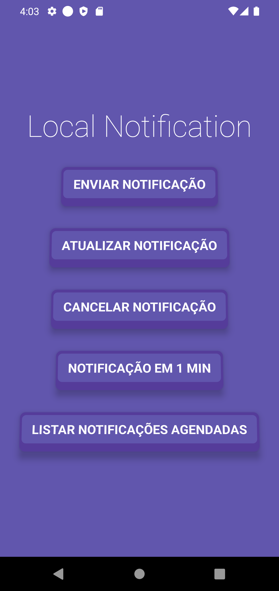

# Notifee Notification 🔔📱

Este é um aplicativo móvel construído com React Native, Expo e TypeScript, projetado para enviar notificações locais para usuários.

Nesta aplicação aprendi a utilizar a lib Notifee para fazer o "crud" nas notificações.

 

## Instalação

Para instalar o localnotification-rn, siga estes passos:

1. Clone este repositório
2. Execute o comando `npm install` para instalar as dependências necessárias
3. Execute o comando `npm expo prebuild` para preparar pra compilação nativa
3. Execute o comando `npx expo run:android` para buildar
3. Execute o comando `npx expo --dev-client` para iniciar o aplicativo

## Tecnologias usadas

O localnotification-rn foi construído utilizando as seguintes tecnologias:

- React Native
- Expo
- TypeScript
- @notifee/react-native
- expo-build-properties

## Licença

Este projeto está licenciado sob a Licença MIT.

  

Projeto desenvolvido com 💜 por [M4rcotoni](https://github.com/m4rcotoni)
